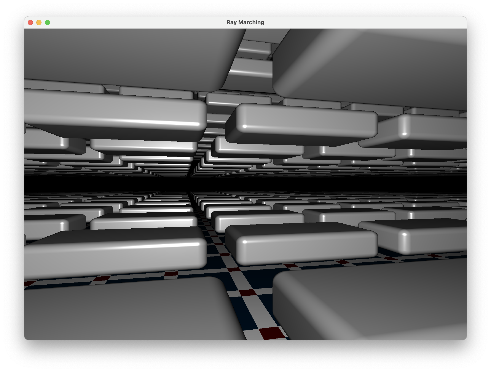

# Raymarch Demo

This demo implements a simple ray marching system to a screen quad based on https://iquilezles.org/articles/raymarchingdf/ 

This project can be used as a simple start point for any ray marching / Shadertoy style system.

